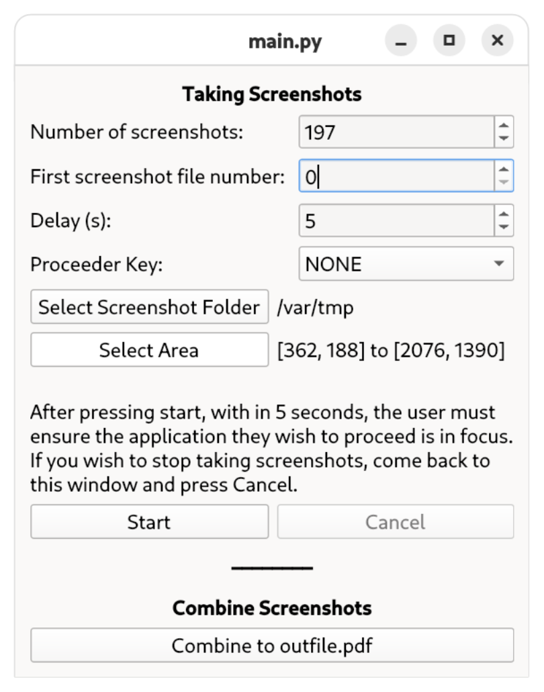

# ScreenshotProceeder

A tool to repeatedly take screenshots, with key input between each screenshot.
 Useful for backing up something without an easy way to download in bulk e.g. an online-only ebook.

The tool will save the screenshots as images. The user can then package these into their preferred format using their favourite tools (e.g. using ImageMagick to convert to pdf).

Disclaimer: From what I gathered, [format shifing is legal in Australia](https://copyright.unimelb.edu.au/shared/using-copyright-material/personal-use).
You are on your own for any act of piracy!
 Also, the tool has only been tested on Fedora Silverblue 41. As this was created for personal use, there is no plan to update it for any other systems.
 
## Pre-requisites:
- Linux system with the following:
    - gnome-screenshot 
    - Python 3.12
    - (optional) ImageMagick - only required if using conversion to pdf.
- Python libraries (captured in src/requirements.txt):
    - PySide6
    - python3-evdev

The application has been tested on Fedora Silverblue 41, running on Wayland.

## How to use
- Setup the pre-requisites
- Run main.py using python: `python main.py`
- Setup the options on the screen.
- Press start. The application will hide itself.
- With in 5 seconds, click the application you want to take the screenshot and apply the proceeding key.
- Wait until all screenshots have been taken. 
    - The tool will show itself at the end. 
    - You can also observe the progress in the terminal.
- If you want to cancel, come back to the application and press cancel.

## Options

- Number of screenshots
- First screenshot file number
    - Each screenshot will be saved as `[number].jpg`. By default, the first screenshot is named `0.jpg`. 
    - Subsequent screenshot number will increment from the start e.g., by default the second is `1.jpg`, the third is `2.jpg`, and so on.
    - This option allows you to change the first screenshot name to the specified number.
     Useful if you have taken a bunch of screenshots and want to go back and fix somethings.
- Delay
    - The delay time between the key input and taking the screenshot.
      This is useful if you want to e.g., wait for the page to load.
- Proceeder Key
    - The input key to 'change the page'. May select 'None' if not necessary.
- Select Screenshot Folder
    - The folder to save the screenshot files into.
- Select Area
    - The area of the screen to capture.
    - Once this button is clicked, a temporary screenshot will be displayed and an area will be selectable. The user should select the desired area they want to capture.

## TODOs
- Could still use some improvements. See working_branch for more.
